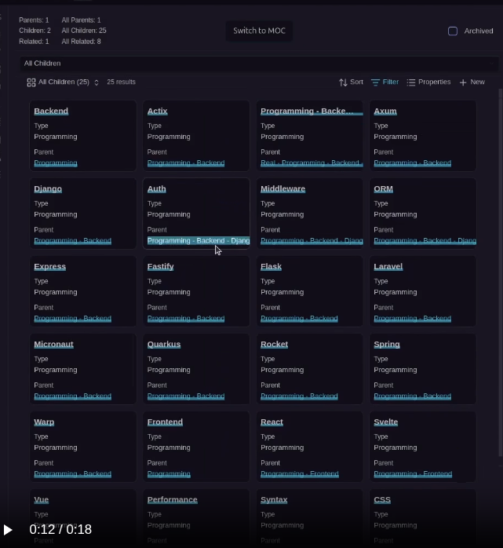
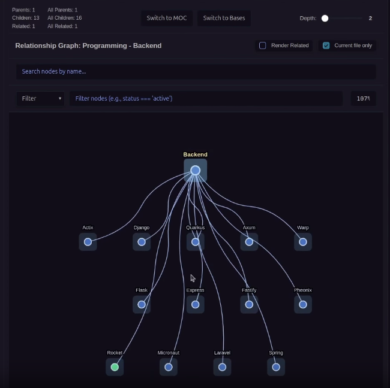
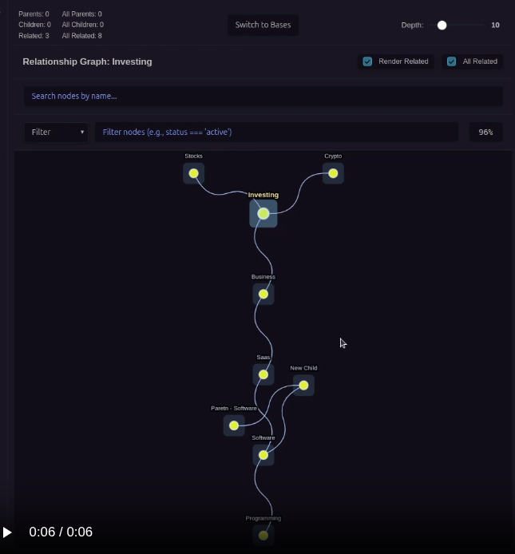
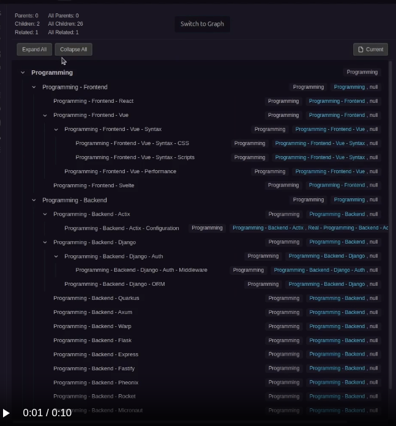

# Nexus Properties

**Automated property management and interactive relationship visualization for Obsidian — bidirectional sync, graph views, and intelligent property inheritance for power users who want structured knowledge networks.**

---

## Video Tutorials

**[View All Video Tutorials →](https://real1tyy.github.io/Nexus-Properties/videos)**

### Full Tutorial — Zero to Mastery

**Complete Workflow Guide**: From installation and creating your first relationships, to bidirectional sync, graph views, color rules, filtering, and more.

### Feature Previews

<table>
<tr>
<td width="50%"></td>
<td width="50%"></td>
</tr>
<tr>
<td width="50%"></td>
<td width="50%"></td>
</tr>
</table>

See the [full documentation](https://real1tyy.github.io/Nexus-Properties/) for all features and video demos.

---

## Who is this for?

Built for **system builders** with large, long-lived vaults who think in hierarchies and networks.

**Good fit if you:**

- Manage complex knowledge systems with hundreds or thousands of notes
- Want structured workflows with consistent, auto-synced metadata
- Value visual navigation of your knowledge structure

**Not ideal if you:**

- Prefer minimal notes without frontmatter
- Don't need structured parent-child or related relationships

---

## Documentation

**[View Full Documentation →](https://real1tyy.github.io/Nexus-Properties/)**

Quick Links:

- [Installation](https://real1tyy.github.io/Nexus-Properties/installation) · [Quick Start](https://real1tyy.github.io/Nexus-Properties/quickstart) · [Configuration](https://real1tyy.github.io/Nexus-Properties/configuration)
- [Features Overview](https://real1tyy.github.io/Nexus-Properties/features/overview) · [FAQ](https://real1tyy.github.io/Nexus-Properties/faq) · [Troubleshooting](https://real1tyy.github.io/Nexus-Properties/troubleshooting)

---

## Installation

Nexus Properties is currently **awaiting approval** for the Obsidian Community Plugin store. In the meantime, you can install it using one of these methods:

### Recommended: BRAT (Beta Reviewers Auto-update Tool)

The easiest way to install and keep Nexus Properties up to date:

1. Install the [BRAT plugin](https://github.com/TfTHacker/obsidian42-brat) from Obsidian's Community Plugins
2. Open BRAT settings (Settings → BRAT)
3. Click **Add Beta Plugin**
4. Enter this repository URL: `https://github.com/Real1tyy/Nexus-Properties`
5. Click **Add Plugin**
6. Enable Nexus Properties in Settings → Community Plugins

BRAT handles updates automatically, so you always have the latest version.

### Manual Installation

1. Go to [Releases](https://github.com/Real1tyy/Nexus-Properties/releases)
2. Download `main.js`, `manifest.json`, and `styles.css`
3. Create folder: `{VaultFolder}/.obsidian/plugins/nexus-properties/`
4. Move downloaded files into the folder
5. Reload Obsidian (`Ctrl/Cmd + R`)
6. Enable Nexus Properties in Settings → Community Plugins

---

## Mobile Support

Nexus Properties is **fully optimized for mobile devices** with touch-friendly interfaces, responsive layouts, and gesture support.

See the [Mobile Support Documentation](https://real1tyy.github.io/Nexus-Properties/mobile) for details.

---

## Key Features

### Bidirectional Sync

Set relationships in one direction, the reverse syncs automatically. Supports parent-child hierarchies and related connections. Automatic cleanup on file deletion, rename, or relationship removal.

### Interactive Graph Views

Visualize relationships with Hierarchical (trees), Related (direct connections), and All Related (constellations) modes. Includes depth control, zoom preview, tooltips, search, and context menus.

### Smart Node Creation

Create child, parent, or related nodes with a single command. New nodes inherit frontmatter, get unique Zettel IDs, and establish bidirectional relationships automatically.

### Color Rules

JavaScript expression-based color rules for visual categorization. First match wins, with enable/disable toggles and priority ordering.

### Filtering

JavaScript expression filtering with named presets, multi-expression AND logic, and indirect connection preservation. Search by filename/path with real-time highlighting.

### Bases View

List-based relationship view with Cards, Table, and List display modes. Custom sorting with YAML formulas, archived filtering, and path-based inclusion rules.

### MOC View

Collapsible tree outline with clickable wiki links. Toggle between current file or topmost parent as root. Supports bullet-list hierarchies as an alternative to frontmatter properties.

### Frontmatter Propagation

Auto-propagate frontmatter changes to children recursively, with optional confirmation and configurable exclusions.

---

## Support & Sponsorship

If you find Nexus Properties useful and want to support its ongoing development, please consider becoming a sponsor. Your contribution helps ensure continuous maintenance, bug fixes, and the introduction of new features.

- [Support My Work](https://matejvavroproductivity.com/support/)

Every contribution, no matter the size, is greatly appreciated!

---

## Contributing

MIT-licensed. PRs welcome! See [Contributing Guide](https://real1tyy.github.io/Nexus-Properties/contributing) for details.

---

## Credits

Built with [Cytoscape.js](https://js.cytoscape.org/) for graph rendering, including hierarchical layouts (via Dagre) and constellation network views.
